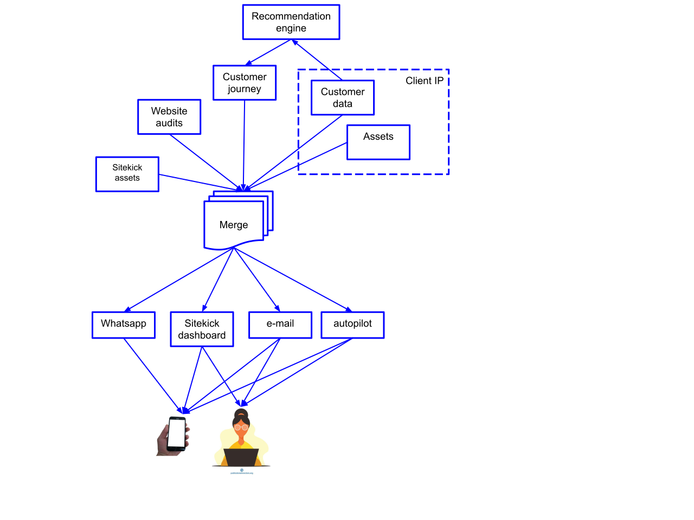

# Sitekick usage guide

## Overview
Sitekick gathers a large amount of information about a website and stores it in a standard way which can be used by a standard web site, custom web site, e-mail or any external system. The gathered information can be used to inform the user about a (large) number of subjects on his web site. As an easy example, the user can be informed about the need for encrypting his connection using SSL, which helps give the visitor a secure feeling and increases the ranking in Google. A more advanced example is informing the user when the SSL certificate is about to expire.

The Sitekick system is modular, extensible and very easily adaptable. You can use it out of the box, add  your own assets and styling, connect your favorite communication systems (like e-mail, WhatsApp, Slack, Autopilot etc.). 

## System overview
Sitekick has two main sources of information: public information from the Internet about websites and client assets. The client generally is a hoster, who can add any custom assets he likes, like CSS, logo's, custom texts, styling etc. The other part of information from the hoster is the customer data, where customer contact data is connected to the domain information.

The general flow for a typical customer:

* Customer is added with contact data and domain. This can be done by the customer himself, or by an action of the client (e.g. when the customer orders the product or the client decides to add the customer to this service, for free or on a trial basis)
* Adding customer/domain triggers a journey. Each message in the journey contains information on one or more audits.
* The required audits are performed so the data is available. This triggers the rendering of the associated template(s).
* When the template is rendered, the information is made available to the communication channel. This can be a page on a web site, an e-mail, a Whatsapp message, a Slack notification etc etc.
* The next message from the journey is selected, based on an algorithm which weighs the outcome of the audits and the response from the user.

The data on the website is public, it is retrieved by visiting the website, without any access to internal data or knowledge.

The customer data and client assets (templates, images, customer data, internal website data like logging) are Intellectual property of the client and 

## HTML templates
Templates can be added to the `html` folder located in the project folder. (for example: `landingpage/html`)
Standard templates are:

* Header (`header.html`)
* Footer (`footer.html`)
* Page template (`page.html`)

The templates must be build using standard HTML5 and Jinja2 template tags. 
See [Jinja2 docs](https://jinja.palletsprojects.com/en/2.10.x/).
Within these templates you can use sub templates using the Jinja2 inheritance structure.

## CSS
CSS can be written in a file located in the `css` folder. The template structure will be included in the docker image
upon build. The Angular based front-end will try to load the `index.css` file. These files are the entry
point for any arbitrary CSS or JS. 

## JS
External Javascript is *not* supported for security reasons.

## images
Images can just be added to the images folder and be referred to in the html templates.

## Dynamic images
Dynamic images (images with personalized content) can be placed in the `personalised_images` folder. In that folder 
PNG's can be placed acting like a frame to render page screenshots in. Every PNG should be accompanied by a json file
stating the location and size of a `mobile` or `desktop` screenshot.